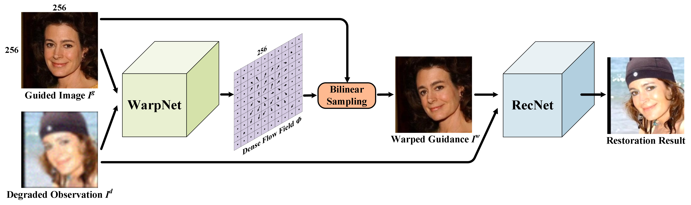
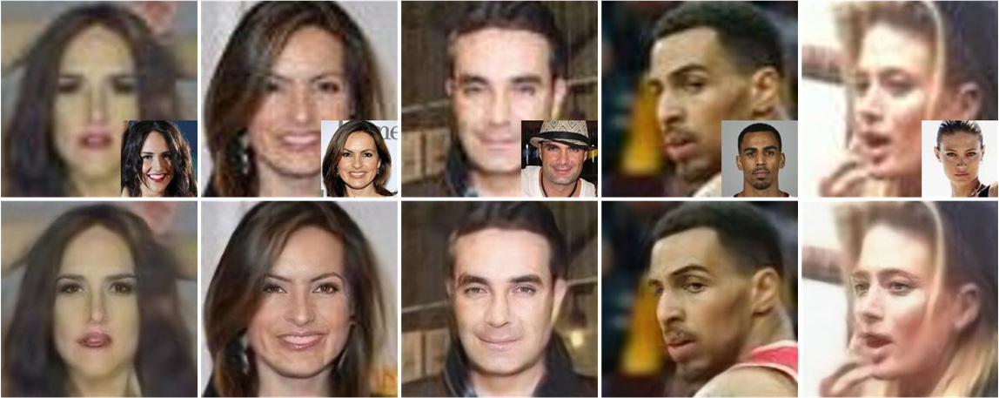
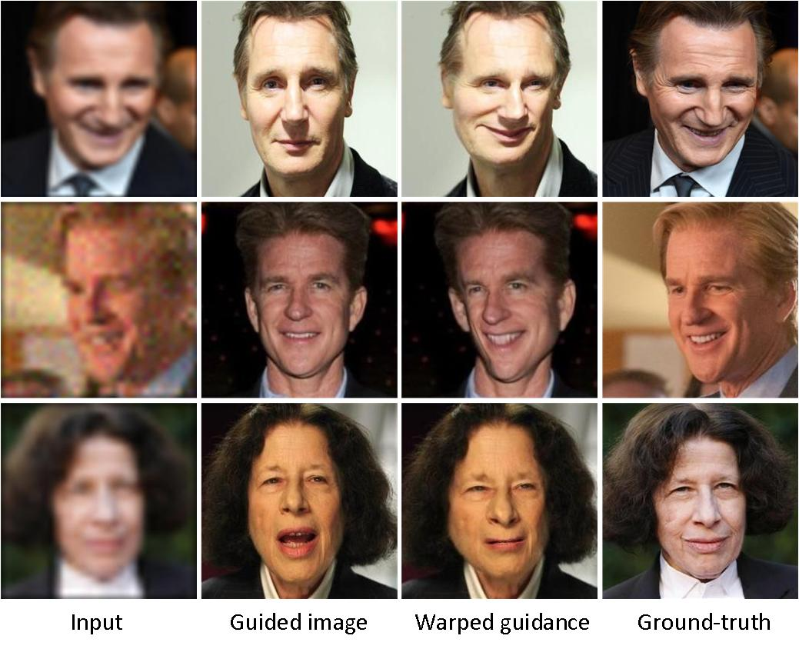
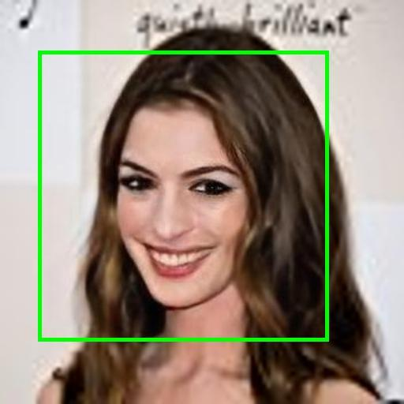
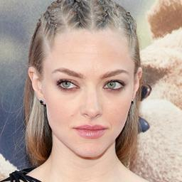
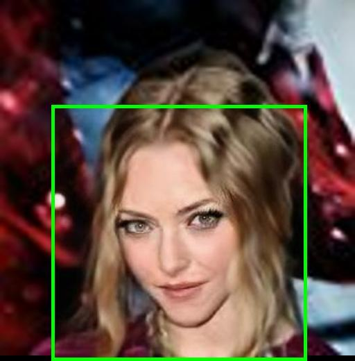

# [GFRNet](https://arxiv.org/abs/1804.04829)
 Torch implementation for [Learning Warped Guidance for Blind Face Restoration](https://arxiv.org/abs/1804.04829)

# GFRNet framework
Overview of our GFRNet. The <B>WarpNet</B> takes the degraded observation and guided image as input to predict the dense flow field, which is adopted to deform guided image to the warped guidance. Warped guidance is expected to be spatially well aligned with ground-truth. Thus the <B>RecNet</B> takes warped guidance and degradated observation as input to produce the restoration result.



# Training

Comming Soon.

# Testing

```bash
th test.lua
```
# Models
Download the pre-trained model with the following url and put it into ./checkpoints/FaceRestoration/.
- [BaiduNetDisk](https://pan.baidu.com/s/1q96l3qmTf5Luh-nlqot6Xw)
- [GoogleDrive](https://drive.google.com/open?id=1PhE3Gi9-eHrofyR3LhqEhuVnzh9D7IsX)

# Results
## Restoration on real low quality images
The first row is real low quality image(close-up in right bottom is the guided image). The second row is GFRNet result.



## Warped guidance



## IMDB results
The content marked with green box is the restoration results by our GFRNet. All of these images are collected from [Internet Movie Database (IMDb)](https://www.imdb.com/). 
 <table style="float:center">
 <tr>
  <th><B>Input</B></th><th><B>Guided Image</B></th><th><B>Bicubic</B></th><th><B>GFRNet Results</B></th>
 </tr>
 <tr>
  <td>
   
  </td>
  <td>
  
  </td>
  <td>
   
  </td>
  <td>
   
  </td>
  </tr>
  <tr>
  <td>
   
  </td>
  <td>
  
  </td>
  <td>
   
  </td>
  <td>
   
  </td>
  </tr>
 </table>
 
- [More IMDB resutls can be found here](http://csxmli.xin/GFRNet/).
- [Supplementary materials can be found here](http://csxmli.xin/GFRNet/supp.pdf).
- [Poster can be found heare](http://csxmli.xin/GFRNet/poster.pdf).

# Requirements and Dependencies

- [Torch](https://github.com/torch/distro)
- [Cuda](https://developer.nvidia.com/cuda-toolkit-archive)-8.0
- [Stn](https://github.com/qassemoquab/stnbhwd)

# Acknowledgments

Code borrows heavily from [pix2pix](https://github.com/phillipi/pix2pix). Thanks for their excellent work!

# Citation

```
@InProceedings{Li_2018_ECCV,
author = {Li, Xiaoming and Liu, Ming and Ye, Yuting and Zuo, Wangmeng and Lin, Liang and Yang, Ruigang},
title = {Learning Warped Guidance for Blind Face Restoration},
booktitle = {The European Conference on Computer Vision (ECCV)},
month = {September},
year = {2018}
}
```
